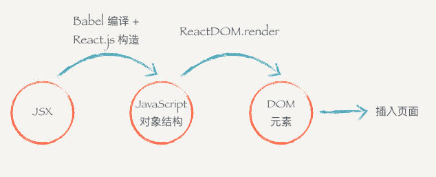

1. JSX 原理
    - 编译的过程会把类似 HTML 的 JSX 结构转换成 JavaScript 的对象结构
    - 上面代码经过编译以后会变成：
        
        ```
        import React, { Component } from 'react'
        import ReactDOM from 'react-dom'
        import './index.css'
        
        class Header extends Component {
          render () {
            return (
             React.createElement(
                "div",
                null,
                React.createElement(
                  "h1",
                  { className: 'title' },
                  "React 小书"
                )
              )
            )
          }
        }
        
        ReactDOM.render(
          React.createElement(Header, null), 
          document.getElementById('root')
        );
        ```
        
    - JSX 到页面到底经过了什么样的过程：
        
        
    - 为什么不直接从 JSX 直接渲染构造 DOM 结构，而是要经过中间这么一层呢？
        - 第一个原因是，当我们拿到一个表示 UI 的结构和信息的对象以后，不一定会把元素渲染到浏览器的普通页面上，我们有可能把这个结构渲染到 canvas 上，或者是手机 App 上。所以这也是为什么会要把 react-dom 单独抽离出来的原因，可以想象有一个叫 react-canvas 可以帮我们把 UI 渲染到 canvas 上，或者是有一个叫 react-app 可以帮我们把它转换成原生的 App（实际上这玩意叫 ReactNative）
        - 第二个原因是，有了这样一个对象。当数据变化，需要更新组件的时候，就可以用比较快的算法操作这个 JavaScript 对象，而不用直接操作页面上的 DOM，这样可以尽量少的减少浏览器重排，极大地优化性能。

    - jsx 总结
        - JSX 是 JavaScript 语言的一种语法扩展，长得像 HTML，但并不是 HTML。
        - React.js 可以用 JSX 来描述你的组件长什么样的。
        - JSX 在编译的时候会变成相应的 JavaScript 对象描述。
        - react-dom 负责把这个用来描述 UI 信息的 JavaScript 对象变成 DOM 元素，并且渲染到页面上。


