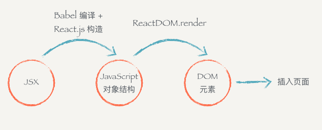

### 安装环境

1. 安装 node.js 环境包括 npm
2. 安装好环境以后，只需要按照官网的指引安装 create-react-app 即可。
    - `npm install -g create-react-app`
3. 这条命令会往我们的机器上安装一条叫 create-react-app 的命令，安装好以后就可以直接使用它来构建一个 react 的前端工程：
    - `create-react-app hello-react `

4. 通过 npm 启动工程：
    - `cd hello-react   npm start`


### 入手项目
1. `src/index.js` 中的代码
    
    ```
    // 必备两条
    /*
    1. 我们在文件头部从 react 的包当中引入了 React 和 React.js 的组件父类 Component。
    2. ReactDOM 可以帮助我们把 React 组件渲染到页面上去
    */
    
    import React, { Component } from 'react';
    import ReactDOM from 'react-dom';
    
    
    import './index.css'
    
    class Header extends Component {
      render () {
        return (
          <div>
            <h1>React 小书</h1>
          </div>
        )
      }
    }
    
    ReactDOM.render(
      <Header />,
      document.getElementById('root')
    )
    ```
2. JSX 原理
    - 编译的过程会把类似 HTML 的 JSX 结构转换成 JavaScript 的对象结构
    - 上面代码经过编译以后会变成：
        
        ```
        import React, { Component } from 'react'
        import ReactDOM from 'react-dom'
        import './index.css'
        
        class Header extends Component {
          render () {
            return (
             React.createElement(
                "div",
                null,
                React.createElement(
                  "h1",
                  { className: 'title' },
                  "React 小书"
                )
              )
            )
          }
        }
        
        ReactDOM.render(
          React.createElement(Header, null), 
          document.getElementById('root')
        );
        ```
        
    - JSX 到页面到底经过了什么样的过程：
        
        
    - 为什么不直接从 JSX 直接渲染构造 DOM 结构，而是要经过中间这么一层呢？
        - 第一个原因是，当我们拿到一个表示 UI 的结构和信息的对象以后，不一定会把元素渲染到浏览器的普通页面上，我们有可能把这个结构渲染到 canvas 上，或者是手机 App 上。所以这也是为什么会要把 react-dom 单独抽离出来的原因，可以想象有一个叫 react-canvas 可以帮我们把 UI 渲染到 canvas 上，或者是有一个叫 react-app 可以帮我们把它转换成原生的 App（实际上这玩意叫 ReactNative）
        - 第二个原因是，有了这样一个对象。当数据变化，需要更新组件的时候，就可以用比较快的算法操作这个 JavaScript 对象，而不用直接操作页面上的 DOM，这样可以尽量少的减少浏览器重排，极大地优化性能。

    - jsx 总结
        - JSX 是 JavaScript 语言的一种语法扩展，长得像 HTML，但并不是 HTML。
        - React.js 可以用 JSX 来描述你的组件长什么样的。
        - JSX 在编译的时候会变成相应的 JavaScript 对象描述。
        - react-dom 负责把这个用来描述 UI 信息的 JavaScript 对象变成 DOM 元素，并且渲染到页面上。

### 组件的 render 方法
1. render 基础
    - 一个组件类必须要实现一个 render 方法，这个 render 方法必须要返回一个 JSX 元素
    - 要注意的是，必须要用一个外层的 JSX 元素把所有内容包裹起来
    - 返回并列多个 JSX 元素是不合法的，必须要用一个外层元素把内容进行包裹：
    
    ```
    render () {
      return (
        <div>
          <div>第一个</div>
          <div>第二个</div>
        </div>
      )
    }
    ```
2. 表达式插入
    - 在 JSX 当中你可以插入 JavaScript 的表达式，表达式返回的结果会相应地渲染到页面上。表达式用 {} 包裹
    
    ```
    render () {
        const special = 'nice';
        const className = 'header'
        return (
            <div className={className}>
                <h1>Tian {special}</h1>
            </div>
        )
    }
    ```
    
    - {} 内可以放任何 JavaScript 的代码，包括变量、表达式计算、函数执行等等
    - 表达式插入不仅仅可以用在标签内部，也可以用在标签的属性上
        - 注意：因为 class 是 JavaScript 的关键字，所以 React.js 中定义了一种新的方式：className 来帮助我们给元素添加类名
        - 还有一个特例就是 for 属性，例如 <label for='male'>Male</label>，因为 for 也是 JavaScript 的关键字，所以在 JSX 用 htmlFor 替代

    - {} 上面说了，JSX 可以放置任何表达式内容。所以也可以放 JSX
    
    ```
    render () {
      const isGoodWord = true
      return (
        <div>
          <h1>
            React 小书
            {isGoodWord
              ? <strong> is good</strong>
              : <span> is not good</span>
            }
          </h1>
        </div>
      )
    }
    ```

### 组件的组合、嵌套和组件树
1. 现在我们已经有了 Header 组件了。假设我们现在构建一个新的组件叫 Title，它专门负责显示标题。你可以在 Header 里面使用 Title组件：
    
    ```
    class Title extends Component {
        render () {
            return (
                <h1>React 小书</h1>
            )
        }
    }
    
    class Header extends Components {
        render () {
            return (
                <div>
                    <Title />
                </div>
            )
        }
    }
    ```
        - 我们可以直接在 Header 标签里面直接使用 Title 标签
        ```
        <div>
          <Title />
          <Title />
          <Title />
        </div>
        ```
        
        - 注意：自定义的组件都必须要用大写字母开头，普通的 HTML 标签都用小写字母开头。

2. 现在让组件多起来。我们来构建额外的组件来构建页面，假设页面是由 Header 、Main 、Footer 几个部分组成，由一个 Index 把它们组合起来。
    
    ```
    import React,{Component} from 'react';
    import ReactDOM from 'react-dom';

    // 标题
    class Title extends Component {
        render () {
            return (
                <h1>Tian</h1>
            )
        }
    }
    // 头部
    class Header extends Component {
        render () {
            return (
                <div>
                    <Title/>
                    <h2>this is header</h2>
                </div>
            )
        }
    }
    // 主体
    class Main extends Component {
        render () {
            return (
                <div>
                    <h2>this is content</h2>
                </div>
            )
        }
    }
    // 底部
    class Footer extends Component {
        render () {
            return (
                <div>
                    <h2>this is footer</h2>
                </div>
            )
        }
    }

    // 整合到 Index
    class Index extends Component {
        render () {
            return (
                <div>
                    <Header/>
                    <Main />
                    <Footer />
                </div>
            )
        }
    }
    ReactDOM.render(
        <Index />,
        document.getElementById('root')
    )

    ```
    
### 事件监听
1. 你只需要给需要监听事件的元素加上属性类似于 onClick、onKeyDown 这样的属性
    
    ```
    // 事件监听
    class Title extends Component {
        isCLick() {
            console.log(11);
        }
        render () {
            return (
                <h1 onClick = {this.isCLick}> Tian</h1>
            )
        }
    }
    ```


